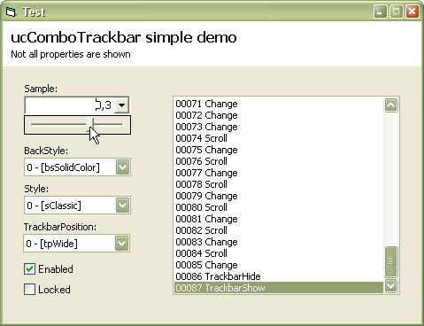



## ucComboTrackbar 1\.2 \(rv 5\)

### Description

A little control: I'm not sure whether 'ucComboTrackbar' is the most appropriate name, but, which one? Quite basic, though it supports 3 appearance styles plus themed one (when available). And not much more... Try it yourself :-) (Last version: 1.2.5 - ~25KB zip)
 
### More Info
 

             |
---                |---
**Submitted On**   |2005-10-30 13:29:40
**By**             |[Carles P\.V\.](https://github.com/Planet-Source-Code/PSCIndex/blob/master/ByAuthor/carles-p-v.md)
**Level**          |Intermediate
**User Rating**    |5.0 (90 globes from 18 users)
**Compatibility**  |VB 6\.0
**Category**       |[Custom Controls/ Forms/  Menus](https://github.com/Planet-Source-Code/PSCIndex/blob/master/ByCategory/custom-controls-forms-menus__1-4.md)
**World**          |[Visual Basic](https://github.com/Planet-Source-Code/PSCIndex/blob/master/ByWorld/visual-basic.md)
**Archive File**   |[ucComboTra1945531132005\.zip](https://github.com/Planet-Source-Code/carles-p-v-uccombotrackbar-1-2-rv-5__1-62954/archive/master.zip)

